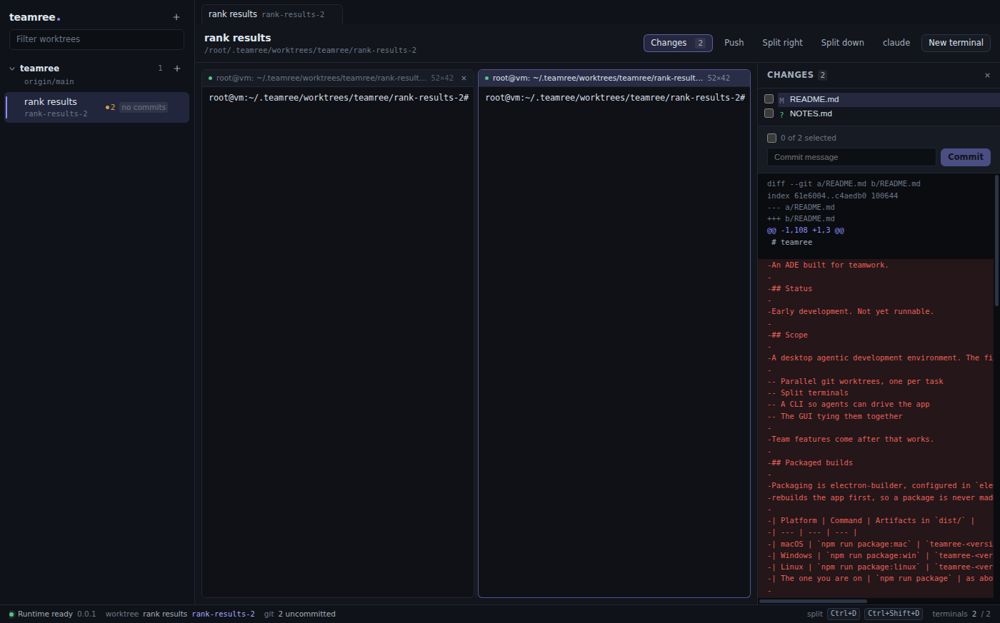

# teamree

An ADE built for teamwork: run several coding agents at once, each in its own
git worktree, and keep track of all of them in one window.



## Status

Single-user and working. Runs from source with `npm run dev`, and packages for
macOS, Windows and Linux — though only macOS has actually been built and
launched; see the known gaps in `ROADMAP.md`, which are recorded rather than
discovered. Team features come after this works.

## What it does

**A worktree per task.** Add a repository, start a worktree from any base ref,
local branch, tag, commit or remote branch. Each one is its own checkout, so
five attempts at the same task never see each other's files.

**Terminals, split however you like.** Arbitrarily nested, resizable panes per
worktree, with a real PTY behind each one.

**Terminals that come back.** Quitting kills every shell — a PTY is a child
process — but a pane running a coding agent comes back with its conversation
resumed, because the agent keeps that on disk and teamree remembers which
session was in which pane. An ordinary pane comes back as a shell in the same
directory, and its command is deliberately never re-run.

**Which agent needs you.** Every pane in every worktree shows what it is doing
— working, waiting, finished, failed — and how long since it last said
anything. That is the question five parallel agents create and the one thing
git status cannot answer. It is deliberately a narrow reading: teamree watches
a PTY, not an agent's protocol, so "waiting" means the output stopped, not that
the agent asked you something.

**All of them at once.** One view lists every pane in every worktree, ordered
by what would make you look: failures first, then work in progress, then
waiting, then finished, and within each the one that has been silent longest.
Counts per state sit above it, and a row takes you to that pane.

**A live picture of the work.** Status per worktree, updated by watching the
checkout rather than by polling, so an edit made by an agent inside a
ten-minute shell session moves the chips immediately. A panel shows the changed
paths and the patch for any of them.

**Enough git to finish.** See what changed, tick what should go in, commit it,
and check whether the branch would merge into its base — answered in memory, so
asking costs the repository nothing. Push when it is ready. There is no force
push and no flag to ask for one.

**Everything the GUI can do, the CLI can do.** `teamree` talks to the running
app over a local socket, so an agent can create a worktree, open a terminal,
run a command and read the output back — and the GUI reflects all of it live,
because both ends meet at the same runtime rather than at a transport.

```sh
teamree worktree create --project app --name "fix login"
teamree worktree wait fix-login
teamree terminal run --worktree fix-login --command "npm test"
teamree worktree changes fix-login
```

**The relay, for when the team is not in one room.** Two machines behind two
routers cannot reach each other, so both dial out to a small relay that splices
their connections together and is never trusted with what crosses it. A team
runs its own, as a Cloudflare Worker or a container — see `relay/README.md`.
`docs/teamwork.md` is the plan the relay is part of.

## Running it

```sh
npm install
npm run dev
```

`npm test` runs the suite, including an acceptance pass that drives a real
runtime over the real socket. `npm run typecheck`, `npm run lint` and
`npm run format` are what CI would check.

## Packaged builds

Packaging is electron-builder, configured in `electron-builder.yml`. Every command
rebuilds the app first, so a package is never made from stale output.

| Platform | Command | Artifacts in `dist/` |
| --- | --- | --- |
| macOS | `npm run package:mac` | `teamree-<version>-arm64.dmg`, `-x64.dmg`, and a `.zip` per architecture |
| Windows | `npm run package:win` | `teamree-<version>-setup-x64.exe` (NSIS) |
| Linux | `npm run package:linux` | `teamree-<version>-x64.AppImage`, `teamree_<version>_amd64.deb` |
| The one you are on | `npm run package` | as above, for the host platform |

Two more, for working on packaging itself:

- `npm run package:dir` — unpacked app only, no installers. Much faster.
- `npm run package:verify` — launches the packaged app against a throwaway
  profile, drives it through the CLI the app ships, opens a real PTY in it and
  reads the output back. This is the check that matters: `node-pty` needs its
  native binary and its `spawn-helper` outside the asar with the executable bit
  intact, and only spawning a shell proves that survived packaging.

Each platform's artifact must be built on that platform. `node-pty` publishes
prebuilt binaries for macOS and Windows but none for Linux, where `npm install`
compiles one — so a Linux package built anywhere else would contain no working
terminal at all. `.github/workflows/package.yml` runs the three builds on three
runners for that reason.

The app icon is generated, not drawn by hand: `npm run icons` rewrites
`build/icon.png`, `build/icon.icns`, `build/icon.ico` and `build/icons/`.

### Signing

Local builds are **unsigned**, and the configuration says so deliberately rather
than half-configuring it. macOS builds are ad-hoc signed, which is the minimum
Apple Silicon needs to launch a binary at all; other machines will still see an
unidentified developer, and Windows will still show SmartScreen.

To produce distributable builds, a maintainer supplies their own credentials —
a Developer ID certificate and an App Store Connect key for macOS, a
code-signing certificate for Windows. The exact environment variables and the
one-line flag change are written down in `electron-builder.yml`, next to the
settings they switch on; `build/entitlements.mac.plist` is already filled in for
a hardened-runtime, notarized build.

## The `teamree` CLI from a packaged install

The CLI ships inside the app, at `resources/cli/` next to a launcher per
platform. The launcher runs the bundled CLI under the app's own Electron binary
in plain-Node mode, so an installed app needs no separate Node runtime. It finds
the running app the same way it always does, through the discovery file the
runtime writes, so the CLI and the GUI stay in step.

Put it on `PATH` once, after installing:

**macOS**

```sh
sudo ln -sf "/Applications/teamree.app/Contents/Resources/cli/teamree" /usr/local/bin/teamree
```

**Linux** (the `.deb` installs to `/opt/teamree`)

```sh
sudo ln -sf /opt/teamree/resources/cli/teamree /usr/local/bin/teamree
```

An AppImage has no fixed install path — its contents only exist while it is
mounted — so use the `.deb` if you want the CLI, or extract the AppImage with
`--appimage-extract` and link the `teamree` inside it.

**Windows** (PowerShell, no admin needed; the default install location is
per-user)

```powershell
$cli = "$env:LOCALAPPDATA\Programs\teamree\resources\cli"
[Environment]::SetEnvironmentVariable(
  'Path', "$([Environment]::GetEnvironmentVariable('Path','User'));$cli", 'User')
```

Open a new terminal afterwards. `teamree.cmd` is what `cmd.exe` resolves and
`teamree.ps1` is what PowerShell resolves; both are in that directory.

Then, with the app running:

```
$ teamree status
```

If the app is not running, the CLI says so and exits 3 rather than hanging.
